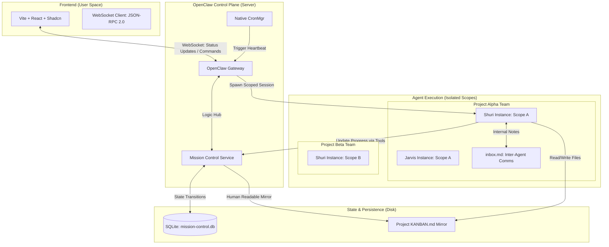
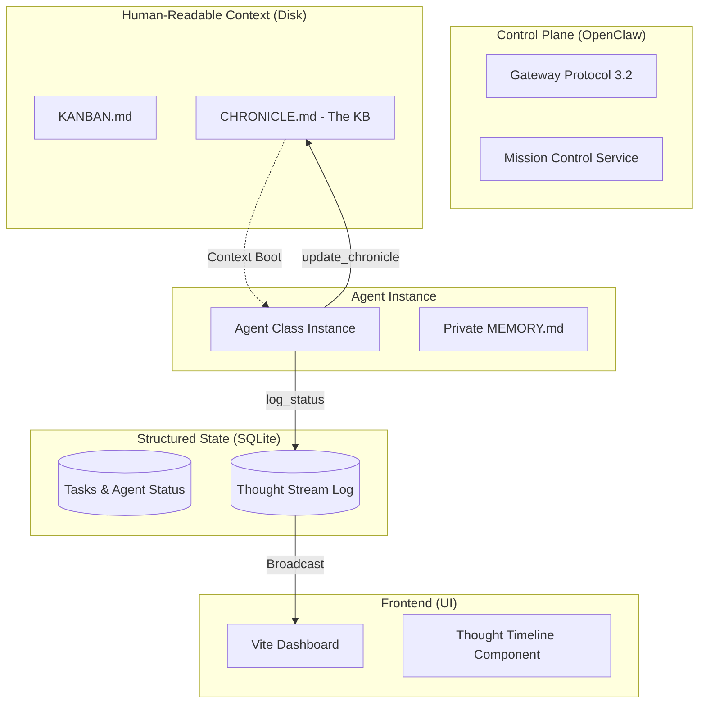

This iterative update focuses on the system's "interconnectedness." Below is the **Technical PRD v1.3**, featuring a high-level architecture diagram and a breakdown of the communication flow between the different layers.

---

# PRD: OpenClaw Mission Control (Project Vanguard)
**Version:** 1.3 (Architecture Visualization)  
**Status:** Architectural Validation  
**Base Framework:** OpenClaw Core (TypeScript/Deno/Node)

---

## 1. High-Level Architecture Diagram

This diagram visualizes how the **Vite UI**, the **OpenClaw Gateway**, the **SQLite State**, and the **Isolated Agent Workspaces** interact.

---

## 2. Component Interconnectivity Breakdown

### A. The UI $\leftrightarrow$ Gateway (The Real-time Link)
*   **Protocol:** Native OpenClaw Protocol 3.2 (WebSocket).
*   **Action:** When you drag a card on the Kanban, the UI sends a `mission.task.move` request.
*   **Reactivity:** Instead of waiting for a "success" response, the UI waits for the Gateway to **broadcast** the update to all connected clients. This ensures the UI is always a true reflection of the SQLite state.

### B. The Gateway $\leftrightarrow$ SQLite/Markdown (The State Link)
*   **Atomic Updates:** Every time a task changes (Assignee, Status, Action), the **Mission Control Service** updates the SQLite DB.
*   **Mirroring:** Simultaneously, it appends a change to the project-specific `KANBAN.md`. 
    *   *Discrepancy Check:* This ensures that if the server is off, a human checking the file system sees: `[ ] task-101 @shuri` $\rightarrow$ `[/] task-101 @shuri`.

### C. The Cron $\leftrightarrow$ Agent (The Heartbeat Link)
*   **The Pulse:** OpenClaw's internal `CronMgr` acts as the "alarm clock." 
*   **Scoped Spawning:** When the alarm goes off, the Gateway initializes a session. The **Scope** parameter (e.g., `project-alpha`) tells the agent's OS where its "office" is. 
*   **Self-Boot:** The agent's first instruction is to query the SQLite state and read its local `inbox.md`.

### D. Agent $\leftrightarrow$ Agent (The Internal Comms Link)
*   **No Central Chat:** Agents do not talk in the main user channel.
*   **File Bus:** "Shuri" writes a note to Jarvis in `projects/alpha/agents/jarvis/inbox.md`.
*   **Notification Flag:** Shuri uses a tool to toggle a `has_unread` bit in SQLite. This causes a notification dot to appear on the Mission Control UI.

---

## 3. Example Data Flow: "The Journey of a Task"

1.  **Creation:** 
    *   User (via UI) creates Task: "Write Python Scraper" for Project Beta.
    *   Gateway adds to `SQLite` and appends to `projects/beta/KANBAN.md`.
2.  **Assignment:** 
    *   Coordinator (Jarvis) wakes up on heartbeat. Sees the task. 
    *   Jarvis calls `send_note(to="Shuri", msg="Start on the scraper")`.
    *   Jarvis updates `SQLite` assignee to "Shuri".
3.  **Execution:** 
    *   Shuri wakes up for her heartbeat in `scope: beta`. 
    *   She reads `agents/shuri/inbox.md`, sees the note, and begins coding in `projects/beta/src/`.
    *   She updates `SQLite` last_action to: "Writing scraper.py...".
4.  **UI Feedback:** 
    *   Gateway sees the update and pushes a WebSocket event to the Vite UI.
    *   The Kanban card for the Scraper scraper shows Shuri's avatar with a green "Thinking" pulse.

---

## 4. Discrepancy Reconciliation (Final Check)

*   **Discrepancy:** High-performance UI vs. Human-readable disk.
*   **Resolution:** SQLite handles the UI (Performance), while the Gateway mirrors state to `KANBAN.md` (Readability).
*   **Discrepancy:** Multiple projects vs. Shared Agent identity.
*   **Resolution:** Agents are defined in global `/souls/`, but instantiated via the Gateway `scope` parameter into isolated `/projects/` folders.

---

## 5. Next Steps for Implementation

1.  **Define the `MC_Service` Typescript Class:** This will be the "Controller" inside OpenClaw that handles the SQLite/Markdown sync logic.
2.  **Dashboard Layout:** Design the Shadcn `ProjectSwitcher` and `KanbanGrid`.
3.  **Tool Registry:** Finalize the `update_task` and `send_note` tool schemas for the agents to call.

**Does this high-level map clarify the interconnections for you? If so, we are ready to move to the code implementation strategy.**

This is exactly the kind of forward-thinking that separates a "dashboard" from an "Operating System." 

By logging the **Thought Process** and maintaining a **Project Narrative (KB)**, we solve the two biggest problems in AI orchestration: **User Anxiety** (What is it doing right now?) and **Context Decay** (Why did we build it this way three days ago?).

Here is my proposal for these two features:

---

### 1. Observability: The "Thought Stream" (SQLite + JSONL)
Instead of just streaming a raw text file (which is messy), we treat **Thoughts** as a structured data type.

**The Proposal:**
*   **Heartbeat Snapshots:** Every time an agent makes an internal "reasoning" step, it calls a tool `log_status(thought: string, step: string)`.
*   **The DB Table:** We add an `agent_thoughts` table to SQLite.
    *   `task_id`, `timestamp`, `thought_summary` (The "Why"), `current_action` (The "What").
*   **UI Implementation:**
    *   **Card Level:** The Kanban card shows a "Live Status" badge: *"Thinking: Analyzing the login logic for security flaws..."*
    *   **Terminal Level:** When you click the card, you see a "Thought Timeline"—a clean, readable list of what the agent has thought and done during this specific session.

**Why this is better:** It allows for **Time Travel Debugging**. You can look back at a task from yesterday and see exactly where the agent's reasoning went off the rails.

---

### 2. Knowledge Base: The "Project Chronicle"
You asked if a KB is overkill. In a multi-agent system, a **Project Chronicle** is **mandatory**. 

**The Problem:** If "Shuri" writes a module for App A today, and "Friday" needs to audit it next week, Friday shouldn't have to read 50,000 lines of `.jsonl` chat logs to understand the "Why." 

**The Proposal: The `CHRONICLE.md` file.**
*   **Nature:** A project-level, human-readable file located at `projects/{id}/CHRONICLE.md`.
*   **The Protocol:** Every time a task is moved to `DONE`, the agent is **required** to perform one final tool call: `update_chronicle(summary, decisions_made, technical_debt)`.
*   **What it holds:**
    *   **Milestones:** "Jan 30: Implemented JWT Auth."
    *   **Architectural Decisions:** "We used SQLite instead of Convex for local-first privacy."
    *   **Caveats:** "The current API is not rate-limited yet."

**Is it overkill? No.** It acts as the **"Collective Long-Term Memory"** for the whole team. When any agent (or you) starts a new task, the first thing they do is read the `CHRONICLE.md`. This ensures the agents don't keep making the same mistakes.

---

### Updated High-Level Architecture (Vanguard v1.4)

I have updated the diagram and specs to include the **Thought Stream** and the **Project Chronicle**.

---

# PRD: OpenClaw Mission Control (Project Vanguard)
**Version:** 1.4 (Observability & Narrative)  
**Status:** Final Draft for Implementation

## New Technical Requirements

### Req 8: Structured Thought Logging
*   **Tool `update_status(thought, action)`:** 
    *   Agents must use this at every significant loop iteration.
    *   **SQLite:** Inserts into `task_events` table.
    *   **UI:** React Query triggers a toast or status update on the Kanban card.

### Req 9: Project Chronicle (KB)
*   **Location:** `~/.openclaw/projects/{id}/CHRONICLE.md`.
*   **Logic:** Non-negotiable final step for the `DONE` transition.
*   **Content:** Must include: Task ID, Decisions Made, and Impact on future tasks.

### Req 10: The Deadman Switch (Failure Recovery)
*   **Logic:** If an agent is in `Thinking` status but the `ThoughtDB` hasn't received an update in 5 minutes, Mission Control Service flags the task as `STALLED` and moves the card to an "Error" state.

---

### Coach's Forward-Thinking Audit:

1.  **Thought Process (✓ Included):** Now logged to SQLite for real-time UI streaming and historical debugging.
2.  **Knowledge Base (✓ Included):** Now implemented as a project-scoped `CHRONICLE.md` to prevent context decay.
3.  **Human-in-the-loop (✓ Included):** Awaiting Human status for blocked tasks.
4.  **Zombie Protection (✓ Included):** Deadman switch for crashed heartbeats.

**Are we ready for the "Master Specification" consolidate file, or is there one more operational scenario you want to cover?** (e.g. How to handle 100+ tasks? Cost tracking/Token usage?)