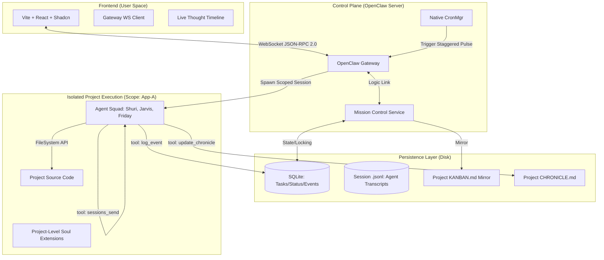

This is the **Technical PRD v3.1** for **OpenClaw Mission Control (Project Vanguard)**. 

This version expands **Section 7** with explicit **JSON-RPC 2.0 payloads** for every core tool, ensuring developers have the exact data structures required to implement the "AI Factory" logic defined in **Spec 4.3** and **Spec 3.2**.

---

# PRD: OpenClaw Mission Control (Project Vanguard)
**Version:** 3.1 (Technical Payload Specification)  
**Status:** Implementation Ready  
**Framework:** OpenClaw Core (TypeScript/Node)  
**Security:** Isolated Scoped Environments (Local-First)

---

## 0. Developer Prerequisites
**Mandatory reading for the implementation team to ensure "OpenClaw-native" behavior:**

1. **Fundamental Philosophy:** [1.1 Key Concepts](https://deepwiki.com/openclaw/openclaw/1.1-key-concepts)
2. **Communication Protocol:** [3.2 Gateway Protocol](https://deepwikhttps://deepwiki.com/openclaw/openclaw/3.2-gateway-protocoli.com/openclaw/openclaw/3.2-gateway-protocol)
3. **Extensibility:** [https://deepwiki.com/openclaw/openclaw/3.3-gateway-service-management](https://deepwiki.com/openclaw/openclaw/3.3-gateway-service-management)
4. **Daemon Management:** [Background Processes](https://docs.openclaw.ai/gateway/background-process)
5. **Memory Layering:** [Snowan Memory System Deep Dive](https://snowan.gitbook.io/study-notes/ai-blogs/openclaw-memory-system-deep-dive)
6. **Team Configuration:** [4.3 Multi-Agent Configuration](https://deepwiki.com/openclaw/openclaw/4.3-multi-agent-configuration)
7.  **Execution:** [https://deepwiki.com/openclaw/openclaw/5-agent-system](https://deepwiki.com/openclaw/openclaw/5-agent-system)
---

## 1. System Vision
Mission Control is the **Control Plane** for OpenClaw. It transforms the system from a reactive "Chatbot" into an autonomous **"AI Factory."** 

It provides a unified Vite/Shadcn interface to manage multiple projects, where specialized **Agent Classes** (Souls) are instantiated into isolated **Project Scopes**. These agents work on a shared **Kanban Task Queue**, communicate natively via the Gateway, and maintain a human-readable **Knowledge Base (Chronicle)**.

---

## 2. High-Level Architecture Diagram



---

## 3. Core Technical Pillars

### 3.1 Scoped Project Isolation
Each project workspace is a strict "Jail."
* **Path Security:** All File-System tools must prepend the scope path.
* Example: If scope is `vidsnap, read_file("main.go")→.openclaw/projects/vidsnap/src/main.go`
* **Traversal Protection:** Path traversal (../) is blocked at the Gateway regex level.
* **Symlink Protection:** The Gateway must resolve paths using fs.realpath before execution. If a resolved path points outside the .openclaw/projects directory, the operation is denied.
Command Restrictions: The system.run tool explicitly blocklists ln (symlink creation) to prevent agents from creating "escape tunnels" to the host OS.

### 3.2 The 4-Layer Memory Stack (Snowan Pattern)
To prevent "Context Decay" and token bloat, agents follow a hierarchical memory structure:

| Layer | Component | File | Strategy |
| :--- | :--- | :--- | :--- |
| **L1** | **Identity** | `SOUL.md` | Persona & Skills (Base + Project Refinement). |
| **L2** | **Context** | `.context` | Fixed project rules (Style guides, Tech stack). |
| **L3** | **Working** | `working.md` | The Active Scratchpad. Cleared upon task completion. |
| **L4** | **Learned** | `learned.md` | Distilled Knowledge. Persistent KB of "how" things were built. |

**The Protocol:** On every pulse, agents read L1-L3. When a task hits `DONE`, the `distill_memory` tool is triggered to move relevant "Working" data into "Learned" data.

### 3.3 Hybrid Persistence (State vs. Narrative)

*   **Single-Writer Requirement:** The **MC_Service (Server)** is the **ONLY** entity authorized to write to `KANBAN.md`.
    *   **Restriction:** Agents are strictly **forbidden** from writing to `KANBAN.md` via standard file tools. They must strictly use the `mission.task.*` RPC methods.
*   **Logic:** When `MC_Service` receives `mission.task.move`:
    1.  **Lock:** Acquire in-memory lock for Project ID.
    2.  **DB:** Update SQLite row.
    3.  **Mirror:** Regenerate `KANBAN.md` string $\rightarrow$ Atomic Write (Write to `.tmp` file then Rename to avoid partial reads).
    4.  **Unlock:** Release Project ID.

---

## 4. The Filesystem Map (Standardization)

```text
~/.openclaw/
├── mission-control.db        # High-Performance State (SQLite)
├── openclaw.json             # Global Agent Manifest
├── souls/                    # GLOBAL CLASSES
│   └── shuri/SOUL.md         # Base Identity
├── projects/                 # ISOLATED SCOPES
│   └── app-vanguard/         # Project Folder
│       ├── KANBAN.md         # Mirrored State (Human Readable)
│       ├── CHRONICLE.md      # The Chronicle (High-level Narrative)
│       ├── .context          # L2: Fixed Project Rules
│       ├── daily/            # L3: Human Chronology logs
│       │   └── 2026-02-02.md # Every pulse result is logged here
│       ├── src/              # Source code
│       └── agents/           # Instance Private Zone
│           └── shuri/
│               ├── working.md # L3: The current task state
│               ├── learned.md # L4: Distilled project wisdom
│               └── SOUL.md    # Instance persona refinement
└── sessions/                 # NATIVE SESSION LOGS (.jsonl)
```
---

## 5. Technical Data Schema (SQLite)

### 5.1 `tasks` Table
Used to render the Kanban columns.
*   **`status` codes:** `0: Backlog`, `1: In-Progress`, `2: Done`, `3: Blocked`, `4: Archive`.

### 5.2 `task_events` Table (The Thought Stream)
Used to render the "Live Terminal" observability view.
*   **Fields:** `id, task_id, agent_id, timestamp, thought, action`.
```sql
-- Project Isolation
CREATE TABLE projects (
    id TEXT PRIMARY KEY,
    name TEXT NOT NULL,
    status TEXT DEFAULT 'active',
    created_at DATETIME DEFAULT CURRENT_TIMESTAMP
);

-- Kanban State
CREATE TABLE tasks (
    id TEXT PRIMARY KEY,
    project_id TEXT REFERENCES projects(id),
    title TEXT NOT NULL,
    assignee_id TEXT NOT NULL, -- Global Soul ID
    status INTEGER CHECK(status BETWEEN 0 AND 4),
    priority INTEGER DEFAULT 3,
    updated_at DATETIME DEFAULT CURRENT_TIMESTAMP
);

-- Reliability & Observability
CREATE TABLE agent_status (
    instance_id TEXT PRIMARY KEY, -- format: "agent:project"
    pgid INTEGER, -- OS Process Group ID (Critical for cleaning up child processes)
    last_pulse DATETIME,
    current_task_id TEXT REFERENCES tasks(id),
    status TEXT DEFAULT 'idle' -- 'working', 'distilling', 'blocked'
);
```
---

## 6. Protocols & Safety

---

### 6.1 The Pulse Engine (Background Process Native)
Mission Control uses the native `background_process.run` protocol instead of a generic cron.

*   **Daemon Tracking:** Every agent pulse is registered in SQLite with its OS Process ID (`pid`).
*   **PID Monitoring:** Mission Control monitors the actual OS process. If a process is "Stalled" (running but not writing to `daily/log.md`), Mission Control issues a `SIGKILL` and restarts the instance.
*   **State Injection:** Every pulse initializes by reading the `working.md` and injecting the latest 5 `task_events` from SQLite.

[SYSTEM STATUS UPDATE]
- Current Project: {{project_id}}
- Current Path: {{scoped_path}}
- Active Task: {{task_title}} (ID: {{task_id}})
- Last Learned Context: [Read learned.md]
- Internal Team Notes: [Read history.jsonl]

INSTRUCTION: Update your status via 'log_event' before taking any tool actions.
### 6.2 Deadman Switch & HITL
*   **Deadman:** `MC_Service` reverts tasks to `To-Do` if an agent is `Working` but silent for > 300s.
*   **HITL:** `request_help` tool moves task to `Blocked` and halts the heartbeat cycle.

---

## 7. Tooling Specification & Payloads

| Method | Role | Payload Key Params |
| :--- | :--- | :--- |
| `mission.project.init` | UI $\rightarrow$ Server | `project_name`, `base_id` |
| `mission.task.create` | UI/Agent $\rightarrow$ Server | `project_id`, `title`, `assignee_id`, `priority` |
| `mission.task.move` | UI/Agent $\rightarrow$ Server | `task_id`, `new_status` |
| `mission.agent.sync` | Agent $\rightarrow$ Server | `instance_id`, `current_task_id`, `status` |
| `mission.event.broadcast`| Server $\rightarrow$ UI | `type` (TASK_UPDATED, THOUGHT_LOG), `data` |


### 7.1 Native Multi-Agent Comms (Spec 4.3)
**Tool:** `sessions_send`
*   **Description:** Injects a message into another session's JSONL history.
*   **Payload Example:**
```json
{
  "jsonrpc": "2.0",
  "method": "sessions_send",
  "params": {
    "session_id": "agent:shuri:mc:vanguard:102",
    "message": "Jarvis here. Market research is ready in research.md. You can start the frontend."
  },
  "id": "mc_001"
}
```

### 7.2 Observability Tool
**Tool:** `log_event`
*   **Description:** Writes the agent's current internal thought and intended action to the SQLite `task_events` table for UI streaming.
*   **Payload Example:**
```json
{
  "jsonrpc": "2.0",
  "method": "mission.control.log",
  "params": {
    "task_id": "task_101",
    "thought": "The user requested a login page. I am checking if we have existing auth middleware.",
    "action": "ls src/middleware"
  },
  "id": "mc_002"
}
```

### 7.3 Narrative Persistence Tool
**Tool:** `update_chronicle`
*   **Description:** Appends a summary to the project-level `CHRONICLE.md`.
*   **Payload Example:**
```json
{
  "jsonrpc": "2.0",
  "method": "mission.control.update_chronicle",
  "params": {
    "project_id": "vanguard",
    "summary": "Implemented SQLite bridge using better-sqlite3. Decisions: Synchronous for local speed.",
    "technical_debt": "Need to implement row-level versioning for concurrency."
  },
  "id": "mc_003"
}
```

### 7.4 Human-In-The-Loop Tool
**Tool:** `request_help`
*   **Description:** Blocks the task and prompts the UI for human input.
*   **Payload Example:**
```json
{
  "jsonrpc": "2.0",
  "method": "mission.control.block",
  "params": {
    "task_id": "task_101",
    "issue": "Missing Stripe API Key. Cannot proceed with payment integration."
  },
  "id": "mc_004"
}
```

### 7.5 Memory Distillation Tool
**Tool:** `distill_memory`
**Description:** Background task to move data from Layer 3 (Working) to Layer 4 (Learned).
**Payload Example:**
{
  "jsonrpc": "2.0",
  "method": "mission.control.distill",
  "params": {
    "agent_id": "shuri",
    "summary": "Verified that SQLite handles concurrency better than JSON for state. Documented the new task table indexing.",
    "archive_working_notes": true
  },
  "id": "mc_005"
}

---

## 8. Frontend Implementation (Vite + Shadcn)

### 8.1 Real-time Updates
The UI does **not** poll. It listens for Gateway events:
*   `mission.task_updated`: Triggers card movement.
*   `mission.thought_logged`: Updates the "Live Terminal" timeline component.

### 8.2 The "Project Switcher"
*   Toggling the Project dropdown calls `gateway.set_scope(project_id)`.
*   The UI clears the current Kanban and reloads cards associated with the new project ID.

---

## 9. Conclusion
Mission Control v3.1 provides the full technical roadmap for a professional-grade AI factory. By combining **Native Multi-Agent Comms (Spec 4.3)** with **Structured Thought Logging**, we create a system that is both autonomous and transparent.

**Next Step for Developers:** Initialize the `mission-control.db` and implement the `MC_Service` class to handle the JSON-RPC methods defined in Section 7.

---

As your PRD coach, I have conducted a **Critical Gap Analysis** on v3.1. 

While the architecture is brilliant, if you hand this to a developer today, they will pause at **three "Implementation Deadlocks"**:
1. **The Orchestration Loop:** The PRD explains the *Pulse*, but not the *Orchestrator's Logic* (How does the server decide which agent to wake up and when?).
2. **The Tool Manifest:** Coder needs the `openclaw.json` tool definitions to register these capabilities in the framework.
3. **File Lock Integrity:** Since multiple agents might try to write to the same project folder, we need a "Concurrency Guard" for the Markdown files.

Below is the **Technical PRD v3.3 (The "Implementation-Ready" Edition)**. I have added the missing **Section 10 (The Implementation Logic)** and **Section 11 (Tool Manifest)**.

---

## 10. The Mission Control Orchestration Loop
The `MC_Service` must implement a "Tick" logic to manage the Staggered Heartbeats and Daemon health.

### 10.1 The "Orchestrator Tick" (Every 30s)
1. **Scan `tasks` table:** Find all tasks with `status = 0 (Backlog)` or `status = 1 (In-Progress)`.
2. **Zombie Check:** For `In-Progress` tasks, check `agent_status`. If `last_pulse` > 5m, issue `gateway.process.kill` and move task back to `Backlog`.
3. **Daemon Check:** If an agent is due for a pulse (based on stagger offset):
   * Call `gateway.process.run` with the `session_key` and `scope`.
   * Inject the **System Pulse Template** (See Section 6.1).
4. **State Mirroring:** If any DB change occurred during the tick, trigger `SyncToMarkdown()`.

### 10.2 File Concurrency Guard
* **Requirement:** The `MC_Service` must implement a **File Mutex (Lock)**. 
* **Logic:** When writing to `KANBAN.md` or `CHRONICLE.md`, the service must ensure no other agent instance is mid-write to avoid file corruption.

---

## 11. Tool Manifest (For `openclaw.json`)
The developer must register these tools in the OpenClaw manifest. Provide this exact schema:

```json
{
  "tools": [
    {
      "name": "log_event",
      "description": "Log internal reasoning and intended tool action to Mission Control.",
      "parameters": {
        "type": "object",
        "properties": {
          "thought": { "type": "string", "description": "The reasoning behind the next step." },
          "action": { "type": "string", "description": "The specific tool/command about to be executed." }
        },
        "required": ["thought", "action"]
      }
    },
    {
      "name": "distill_memory",
      "description": "Move active task state to long-term project knowledge (Learned Memory).",
      "parameters": {
        "type": "object",
        "properties": {
          "summary": { "type": "string", "description": "Distilled wisdom from the completed task." }
        },
        "required": ["summary"]
      }
    },
    {
      "name": "request_help",
      "description": "Signal that human intervention is required to proceed.",
      "parameters": {
        "type": "object",
        "properties": {
          "issue": { "type": "string", "description": "Description of the blocker." }
        },
        "required": ["issue"]
      }
    }
  ]
}
```

---

## 12. UI Routing & State (The Vite Side)
To ensure the coder starts the frontend correctly:

1. **Routing:** 
   * `/` : Project Overview (List of Apps).
   * `/:project_id` : The Main Kanban Board.
2. **State Store:** Use `Zustand` or `Redux` to hold the WebSocket state.
3. **Live Terminal Logic:** The "Live Terminal" component should filter the `task_events` table for only the currently selected `task_id`.

---

## 13. Critical Analysis & Coder "Quick Start"
**Is this enough for a coder to start?**
* **Yes, but they need the "Bootstrap Script".**
* **Coach's Suggestion:** Include a `scripts/init_mc.ts` file that creates the `mission-control.db` and the basic `/souls` folder structure so the developer has a working environment in 1 click.

### Final Checklist for the Dev:
1. [ ] **DB Init:** Run SQLite schema in Section 5.2.
2. [ ] **Gateway Hook:** Create `src/services/MissionControl.ts` and register it in `gateway/server.impl.ts`.
3. [ ] **Frontend Conn:** Connect Vite UI to the Gateway URL (default `ws://localhost:8000`).
4. [ ] **First Pulse:** Manually trigger a pulse for `shuri` to verify she reads the `tasks` table.

---

### Coach's Final Summary
With the addition of the **Orchestration Loop (Section 10)** and the **Tool Manifest (Section 11)**, the developer no longer has to guess how the "Pulse" is triggered or how tools are structured. 

**This is now a complete, professional-grade technical specification.** You are ready to build.

---