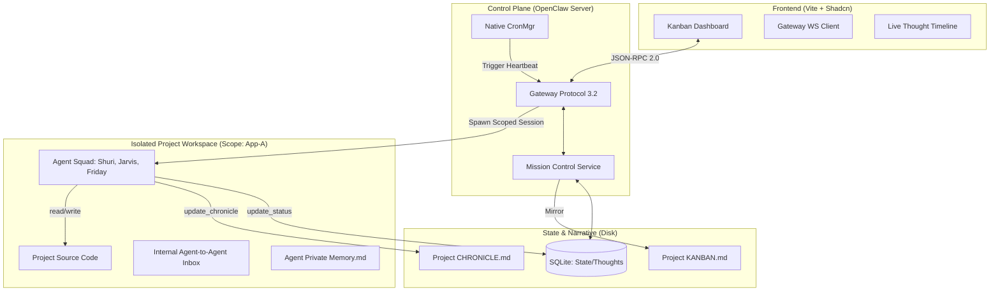

This is the **Master Technical Product Requirements Document (PRD) v1.5** for **Project Vanguard: OpenClaw Mission Control**. 

It has been rewritten from the ground up to integrate all architectural iterations into a single, cohesive specification.

---

# PRD: OpenClaw Mission Control (Project Vanguard)
**Version:** 1.5 (Master Specification)  
**Status:** Implementation Ready  
**Framework:** OpenClaw Core (TypeScript/Deno/Node)  
**Philosophy:** Local-first, Human-readable persistence, Agent-OS Orchestration.

---

## 1. System Vision
Mission Control transforms OpenClaw from a reactive chatbot into a proactive **AI Factory**. It provides a real-time, multi-project orchestration layer where autonomous agents (Agent Classes) are instantiated into isolated project environments (Agent Instances) to solve complex task queues managed via a Kanban-style interface.

---

## 2. High-Level Architecture



---

## 3. Core Technical Pillars

### 3.1 Hybrid Persistence (The "Muscles & Brain" Rule)
*   **The Muscles (SQLite):** Used for UI reactivity, task locking, and high-frequency thought logging. Located at `~/.openclaw/mission-control.db`.
*   **The Brain (Markdown):** Used for long-term project memory and human auditing. Every SQLite update is mirrored to `projects/{id}/KANBAN.md`.

### 3.2 Project Scoping & Isolation
*   Isolation is enforced via the OpenClaw **`scope`** parameter.
*   Agents are defined as **Global Souls** (`~/.openclaw/souls/shuri/SOUL.md`).
*   Agents are instantiated as **Project Instances**. On boot, they inherit the Global Soul and extend it with a **Project Soul** (`projects/{id}/agents/shuri/SOUL.md`).

---

## 4. The Data Schema (SQLite)

### 4.1 Tasks & Projects
*   **`projects`**: `id (PK), name, description, status`
*   **`tasks`**: `id (PK), project_id, title, status (0:Backlog, 1:Progress, 2:Done, 3:Blocked, 4:Archive), assignee_id, priority`

### 4.2 Observability & Reliability
*   **`agent_status`**: `instance_id (PK), status (Thinking, Working, Idle, Stalled), last_heartbeat, current_task_id`.
*   **`task_events`**: `id, task_id, agent_id, timestamp, thought (Reasoning summary), action (The tool call being made)`.

---

## 5. Operational Protocols

### 5.1 The Staggered Heartbeat (Native Cron)
Utilizes OpenClaw `CronMgr`. Each agent is triggered at a specific offset.
*   **Wakeup Instruction:** "You are [Agent] in project [Scope]. Check `mission_control.db`. If task is assigned, log your current thought to `task_events` and continue."

### 5.2 Failure Recovery (The Deadman Switch)
*   The `MC_Service` monitors `agent_status.last_heartbeat`. 
*   If an agent is in `Thinking` status but no `task_event` or heartbeat is recorded for > 5 minutes, the task is automatically reverted to `To-Do` and marked as `STALLED`.

### 5.3 Human-In-The-Loop (HITL)
*   Agents can call tool `request_help(issue)`. 
*   This moves the task to `Blocked`, sends a notification via the Gateway, and halts the heartbeat for that specific task.

---

## 6. Knowledge Base: The Project Chronicle
To prevent context decay, agents maintain a **Knowledge Base (KB)** on disk.
*   **File:** `projects/{id}/CHRONICLE.md`.
*   **Protocol:** Before a task transitions to `DONE`, the agent **must** execute `update_chronicle()`.
*   **Content:** Summary of work, Architectural Decisions (ADRs), and known Technical Debt.

---

## 7. The Mission Control UI (Vite + React)

### 7.1 Real-time Kanban
*   **Subscription:** Connects to `ws://openclaw/gateway`. Listens for `TASK_UPDATED` and `AGENT_THOUGHT` events.
*   **Locking:** If a card's agent is `Thinking`, the UI disables drag-and-drop for that card to prevent race conditions.

### 7.2 The "Live Terminal" (Observability)
*   Clicking a task card opens a side panel rendering the `task_events` for that session.
*   **Visuals:** Shows a timeline of "Thoughts" vs "Actions."

---

## 8. Directory Structure (Implementation)

```text
~/.openclaw/
├── openclaw.json             # Agent Registry
├── mission-control.db        # SQLite State
├── souls/                    # Global Agent Personas
│   └── shuri/SOUL.md
├── projects/                 # Scoped Workspaces
│   └── app-vanguard/
│       ├── KANBAN.md         # Mirrored State
│       ├── CHRONICLE.md      # Knowledge Base
│       ├── .context          # Project Rules
│       ├── src/              # Codebase
│       └── agents/           # Instance Memory
│           └── shuri/
│               ├── SOUL.md   # Project-level Soul extension
│               ├── MEMORY.md # Project-level long-term memory
│               └── inbox.md  # Inter-agent file bus
```

---

## 9. Tooling Specification (For OpenClaw Registry)

1.  **`log_status(thought, action)`**: Writes structured reasoning to SQLite `task_events` and broadcasts to UI.
2.  **`send_internal_note(recipient, message)`**: Appends a note to the recipient's `inbox.md` within the current project scope.
3.  **`update_chronicle(summary, decisions)`**: Appends the "Why" and "How" of a completed task to the `CHRONICLE.md`.
4.  **`request_human_intervention(issue)`**: Sets task to `Blocked` and notifies user.

---

## 10. Discrepancy Reconciliation Checklist
*   **[✓] Local-First:** No Convex/Cloud. SQLite + Markdown only.
*   **[✓] Native Protocol:** Uses JSON-RPC 2.0 via WebSocket (3.2).
*   **[✓] Human Readable:** Audit-ready `KANBAN.md` and `CHRONICLE.md` on disk.
*   **[✓] Observability:** Real-time thought streaming via structured DB logging.
*   **[✓] Scalability:** Multi-project isolation via `scope`.

---

**Coach's Final Evaluation:** This PRD v1.5 is forward-thinking and robust. It solves the "Black Box" problem, ensures failure recovery, and respects the core OpenClaw philosophy of disk-based state. 

**This document is ready to be passed to the developers for the "Vanguard" implementation.**