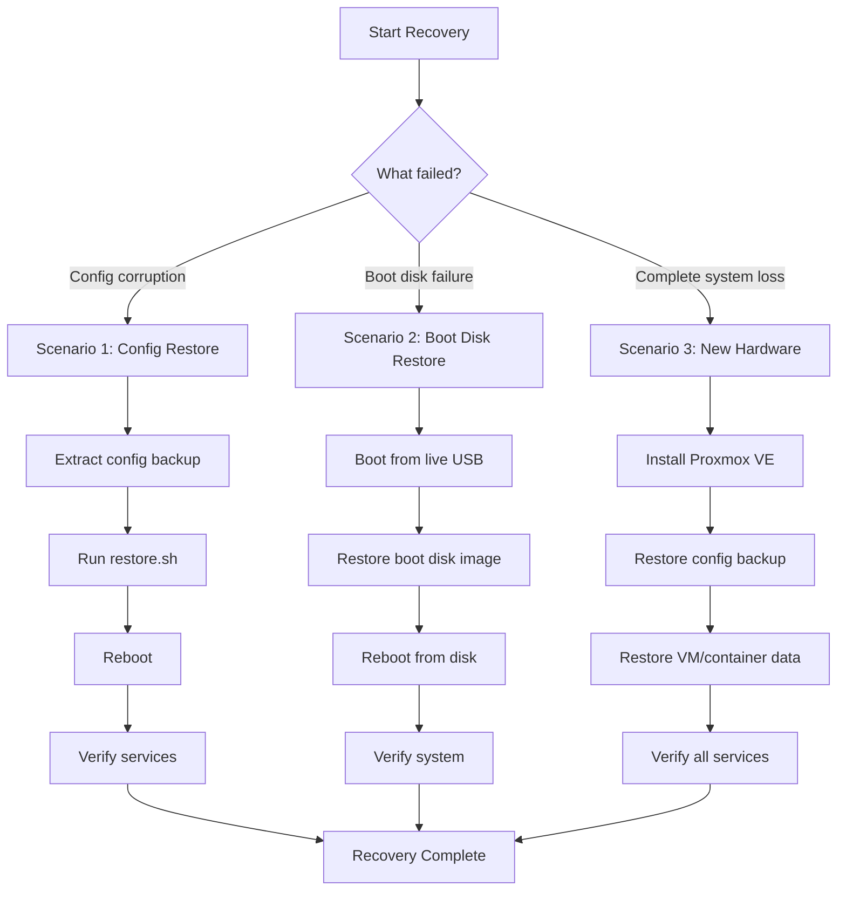

# Proxmox VE Disaster Recovery Procedure

**Host**: pve2 (192.168.1.10)
**Proxmox Version**: 8.4.14
**Kernel**: 6.8.12-15-pve
**Last Updated**: 2025-02-05

---

## Table of Contents

1. [Overview](#overview)
2. [Backup Architecture](#backup-architecture)
3. [Prerequisites](#prerequisites)
4. [Recovery Scenarios](#recovery-scenarios)
   - [Scenario 1: Configuration-Only Restore](#scenario-1-configuration-only-restore)
   - [Scenario 2: Boot Disk Restore (Bare Metal)](#scenario-2-boot-disk-restore-bare-metal)
   - [Scenario 3: Complete Disaster Recovery (New Hardware)](#scenario-3-complete-disaster-recovery-new-hardware)
5. [Verification Steps](#verification-steps)
6. [Rollback Procedures](#rollback-procedures)
7. [Recovery Time Estimates](#recovery-time-estimates)
8. [Contact Information](#contact-information)
9. [Appendices](#appendices)

---

## Overview

This document provides comprehensive disaster recovery procedures for the Proxmox VE host **pve2** (192.168.1.10). The system implements a two-tier backup strategy:

1. **Configuration Backup** - Fast recovery of Proxmox settings, VM/container configs, network, and storage
2. **Boot Disk Backup** - Complete system image for bare-metal recovery

### What Gets Backed Up

**Configuration Backup (≈250MB compressed)**:
- All Proxmox configurations (`/etc/pve/`)
- Network configuration (`/etc/network/interfaces`)
- Storage configuration (`/etc/pve/storage.cfg`)
- User authentication and SSH keys
- VM and container configurations
- Installed packages and repositories
- Firewall rules and service configurations
- Custom kernel modules and firmware
- SSL certificates

**Boot Disk Backup (≈16GB compressed)**:
- Complete block-level image of `/dev/nvme0n1`
- Bootloader and EFI partition
- Entire Proxmox VE installation
- All system configurations
- Enables bare-metal restore to new hardware

### Critical Services

The following services run on pve2:

| Service | Type | IP Address | Purpose |
|---------|------|------------|---------|
| OPNsense Firewall | VM 133 | Bridges only | Network gateway and firewall |
| Confluence | CT 100 | 192.168.1.21 | Production wiki |
| Docker Host | CT 101 | 192.168.1.20 | Container platform |
| Jira | CT 102 | 192.168.1.22 | Issue tracking |
| Seafile Files | CT 103 | 192.168.1.25 | File sharing |
| Mail Server | CT 105 | 192.168.1.24 | Email services |
| Wanderwish | CT 109 | 192.168.1.29 | Application server |
| Ansible Mgmt | CT 110 | 192.168.1.26 | Automation |
| Hestia Server | CT 111 | 192.168.1.30 | Web hosting |

---

## Backup Architecture

### Storage Locations

**Local Backup Storage**:
- Path: `/mnt/ssd_4tb/comprehensive-backups/`
- Retention: 30 days
- Format: `proxmox-comprehensive-YYYYMMDD-HHMMSS/`

**Remote Backup Storage** (OMV - 192.168.1.9):
- Path: `/root/proxmox-backups/`
- Sync method: rsync over SSH
- Format: `proxmox-comprehensive-YYYYMMDD-HHMMSS.tar.gz`

### Backup Directory Structure

```
proxmox-comprehensive-20260205-020001/
├── backup.log                          # Backup execution log
├── boot-disk/                          # Boot disk image (if created)
│   └── disk-info.txt                   # Disk information
├── config/                             # Configuration backup
│   └── bare-metal-backup/
│       ├── restore.sh                  # Automated restore script
│       ├── backup-info.txt             # Backup metadata
│       ├── certificates/               # SSL certificates
│       ├── drivers/                    # Kernel modules and firmware
│       ├── firewall/                   # Firewall rules
│       ├── hardware/                   # Hardware information
│       ├── network/                    # Network configuration
│       ├── packages/                   # Package lists and sources
│       ├── pve-config/                 # Proxmox configuration
│       ├── services/                   # Service configuration
│       ├── ssh/                        # SSH keys
│       └── storage/                    # Storage configuration
├── metadata/
│   └── backup-info.json                # Backup metadata (JSON)
├── scripts/                            # Recovery scripts
│   ├── comprehensive-restore.sh        # Main restore script
│   ├── proxmox-disaster-recovery.sh    # Full DR script
│   └── proxmox-configuration.md        # Configuration documentation
└── verification/
    └── integrity-check.txt             # Backup verification results
```

### Backup Schedule

The comprehensive backup script runs daily via cron:

```bash
# Daily comprehensive backup at 2:00 AM
0 2 * * * /root/disaster-recovery/proxmox-comprehensive-backup.sh full
```

**Backup Types**:
- `full` - Configuration + boot disk + remote sync
- `config` - Configuration only
- `boot` - Boot disk image only
- `sync` - Sync latest backup to remote storage

### Recovery Flow Diagram



---

## Prerequisites

### Required Tools and Media

**For Configuration Restore**:
- SSH access to the Proxmox host
- Root privileges
- Backup archive (available locally or remotely)

**For Boot Disk Restore**:
- Live Linux USB (Ubuntu 20.04+ or SystemRescue)
- External storage for backup image (if not on local disk)
- Target disk at least as large as original (16GB minimum)

**For Complete Disaster Recovery**:
- Proxmox VE 8.x installation ISO
- Network access to backup storage
- New hardware with compatible architecture (x86_64)

### Access Credentials

**Proxmox Host (pve2)**:
- IP Address: 192.168.1.10
- SSH User: root
- Backup Location: `/mnt/ssd_4tb/comprehensive-backups/`

**Remote Backup (OMV)**:
- IP Address: 192.168.1.9
- SSH User: root
- Backup Location: `/root/proxmox-backups/`

### Network Requirements

- LAN connectivity (192.168.1.0/24)
- Gateway: 192.168.1.3 (OPNsense)
- DNS: 192.168.1.5 (Pi-hole) or 1.1.1.1

---

## Recovery Scenarios

### Scenario 1: Configuration-Only Restore

**When to Use**:
- Proxmox configuration corrupted
- VM/container configurations lost
- Network settings need restoration
- After failed system updates
- **REQUIREMENT**: Hardware is functional, Proxmox is installed

**Recovery Time**: 15-30 minutes

#### Step-by-Step Procedure

**1. Identify the Backup to Restore**

```bash
# SSH to pve2
ssh root@192.168.1.10

# List available backups
ls -la /mnt/ssd_4tb/comprehensive-backups/

# Or check remote storage
ssh root@192.168.1.9 "ls -la /root/proxmox-backups/"
```

**2. Extract the Configuration Backup**

```bash
# Navigate to backup directory
cd /mnt/ssd_4tb/comprehensive-backups/proxmox-comprehensive-20260205-020001

# Extract configuration backup
tar -xzf config/bare-metal-backup.tar.gz -C /tmp/
```

**3. Run the Automated Restore Script**

```bash
# Navigate to extracted backup
cd /tmp/bare-metal-backup

# Review the restore script
cat restore.sh

# Execute restore
./restore.sh
```

**4. Manual Restore Steps (if script fails)**

```bash
# Stop Proxmox services
systemctl stop pveproxy pvedaemon pve-cluster

# Restore network configuration
cp /tmp/bare-metal-backup/network/interfaces /etc/network/
cp /tmp/bare-metal-backup/network/hosts /etc/

# Restore Proxmox configuration
cp -r /tmp/bare-metal-backup/pve-config/* /etc/pve/

# Restore storage configuration
cp /tmp/bare-metal-backup/storage/storage.cfg /etc/pve/

# Restore SSH keys
cp -r /tmp/bare-metal-backup/ssh/ssh/* /etc/ssh/
cp -r /tmp/bare-metal-backup/ssh/root-ssh /root/.ssh

# Restore certificates
cp -r /tmp/bare-metal-backup/certificates/* /etc/pve/nodes/pve2/

# Restart services
systemctl daemon-reload
systemctl start pve-cluster pvedaemon pveproxy

# Reboot to apply network changes
reboot
```

**5. Verify the Restore**

```bash
# After reboot, check hostname
hostname
# Expected output: pve2

# Check IP address
ip addr show vmbr0
# Expected output: 192.168.1.10/24

# Check VM configurations
qm list
# Should show VM 133 (opnsense)

# Check container configurations
pct list
# Should show containers 100-111

# Verify storage
pvesm status
# Should show local, local-lvm, and ssd-4tb
```

---

### Scenario 2: Boot Disk Restore (Bare Metal)

**When to Use**:
- Boot disk failure
- Corrupted bootloader
- System won't boot
- Complete OS corruption
- **REQUIREMENT**: Have a boot disk backup image

**Recovery Time**: 1-2 hours

#### Step-by-Step Procedure

**1. Prepare Recovery Media**

```bash
# Create a live Linux USB on another machine
# Download SystemRescue or Ubuntu Server
# Use dd or Etcher to write to USB

sudo dd if=systemrescue.iso of=/dev/sdX bs=4M status=progress
```

**2. Boot from Live USB**

1. Insert USB into pve2
2. Boot from USB (may need to change boot order in BIOS)
3. Select "Boot SystemRescue" (or equivalent)

**3. Identify Disks**

```bash
# List all disks
lsblk

# Identify the boot disk (usually /dev/nvme0n1 or /dev/sda)
# Identify the backup disk (where the backup image is stored)
```

**4. Mount Backup Storage**

```bash
# Create mount point
mkdir /mnt/backup

# Mount the backup disk (replace with actual device)
mount /dev/sdX1 /mnt/backup

# Navigate to backup
cd /mnt/backup/comprehensive-backups/proxmox-comprehensive-20260205-020001/boot-disk
```

**5. Restore Boot Disk Image**

**CRITICAL**: Double-check the target disk to avoid data loss!

```bash
# Verify the target disk
lsblk /dev/nvme0n1

# Uncompress and restore the image
# This will take 30-60 minutes
gunzip -c pve2-boot-*.img.gz | dd of=/dev/nvme0n1 bs=4M status=progress

# OR if using lz4 compression
lz4 -d -c pve2-boot-*.img.lz4 | dd of=/dev/nvme0n1 bs=4M status=progress

# OR if using zstd compression
zstd -d -c pve2-boot-*.img.zst | dd of=/dev/nvme0n1 bs=4M status=progress
```

**6. Verify the Restore**

```bash
# Check partition table
fdisk -l /dev/nvme0n1

# Should show:
# - EFI partition (≈512MB)
# - boot partition (≈1GB)
# - LVM partition (remaining space)

# Reboot from the restored disk
reboot
```

**7. Post-Restore Verification**

```bash
# After boot, verify system is operational
hostname
# Expected: pve2

# Check Proxmox version
pveversion
# Should show version 8.4.x

# Verify network
ip addr show vmbr0
# Expected: 192.168.1.10/24

# Check VMs and containers
qm list
pct list
```

---

### Scenario 3: Complete Disaster Recovery (New Hardware)

**When to Use**:
- Complete hardware failure
- Building new server from scratch
- Migrating to different hardware
- **REQUIREMENT**: New hardware with compatible architecture

**Recovery Time**: 2-4 hours

#### Step-by-Step Procedure

**1. Prepare New Hardware**

```bash
# Requirements:
- x86_64 architecture
- Minimum 16GB RAM (32GB+ recommended)
- Network interface (2 NICs preferred for OPNsense)
- Storage: 16GB+ for boot, additional for VMs
```

**2. Install Proxmox VE**

1. Download Proxmox VE 8.x ISO from https://www.proxmox.com/en/downloads
2. Create bootable USB
3. Boot new hardware from USB
4. Follow installation wizard:
   - **Target Harddisk**: Select boot disk (e.g., /dev/nvme0n1)
   - **Country/Time Zone**: Your location
   - **Network**: Static IP 192.168.1.10/24, Gateway 192.168.1.3
   - **Password**: Choose secure password
   - **Email**: Admin email

**3. Access Proxmox Web Interface**

```bash
# URL: https://192.168.1.10:8006
# Login: root
# Password: (set during installation)
```

**4. Transfer Backup Archive**

```bash
# From backup storage (OMV) to new Proxmox host
ssh root@192.168.1.9 "cat /root/proxmox-backups/proxmox-comprehensive-20260205-020001.tar.gz" | \
  ssh root@192.168.1.10 "cat > /root/proxmox-backup.tar.gz"

# Or download directly
scp root@192.168.1.9:/root/proxmox-backups/proxmox-comprehensive-*.tar.gz /root/
```

**5. Extract and Run Disaster Recovery Script**

```bash
# Extract backup
cd /root
tar -xzf proxmox-backup.tar.gz
cd proxmox-comprehensive-20260205-020001

# Run the comprehensive disaster recovery script
bash scripts/proxmox-disaster-recovery.sh
```

**6. Manual Configuration (if script unavailable)**

```bash
# Extract configuration backup
tar -xzf config/bare-metal-backup.tar.gz

# Restore network configuration
cp bare-metal-backup/network/interfaces /etc/network/
cp bare-metal-backup/network/hosts /etc/

# Restore Proxmox configuration
systemctl stop pve-cluster
cp -r bare-metal-backup/pve-config/* /etc/pve/
systemctl start pve-cluster

# Restore storage configuration
mkdir -p /mnt/ssd_4tb
# Mount storage disk (adjust as needed)
mount /dev/sdX1 /mnt/ssd_4tb

# Configure storage in Proxmox UI or via CLI
pvesm add dir ssd-4tb --path /mnt/ssd_4tb --content vztmpl,iso,backup,snippets,images,rootdir

# Restore SSH keys
cp -r bare-metal-backup/ssh/ssh/* /etc/ssh/
```

**7. Restore VM and Container Configurations**

```bash
# Copy VM configs
cp bare-metal-backup/pve-config/qemu-server/133.conf /etc/pve/qemu-server/

# Copy container configs
for ct in 100 101 102 103 105 109 110 111; do
  cp bare-metal-backup/pve-config/lxc/${ct}.conf /etc/pve/lxc/
done
```

**8. Restore VM/Container Data**

This step depends on whether you have VM/container backups:

**If you have vzdump backups**:

```bash
# Restore OPNsense VM
qmrestore /mnt/ssd_4tb/dump/vzdump-qemu-133-*.vma.zst 133

# Restore containers
pct restore 100 /mnt/ssd_4tb/dump/vzdump-lxc-100-*.tar.zst
pct restore 101 /mnt/ssd_4tb/dump/vzdump-lxc-101-*.tar.zst
# ... repeat for all containers
```

**If you only have raw disk images**:

```bash
# Create VM with existing disk
qm importdisk 133 /path/to/opnsense-disk.qcow2 local-lvm
qm set 133 --scsi0 local-lvm:vm-133-disk-0
```

**9. Start Services in Correct Order**

```bash
# 1. Start OPNsense first (gateway)
qm start 133

# Wait 2-3 minutes for OPNsense to boot

# 2. Start production containers
pct start 100  # Confluence
pct start 101  # Docker
pct start 102  # Jira
pct start 103  # Files
pct start 105  # Mail

# 3. Start other containers
pct start 109  # Wanderwish
pct start 110  # Ansible
pct start 111  # Hestia
```

**10. Verify All Services**

```bash
# Check VM status
qm status 133
# Expected: VM 133 running

# Check container status
pct list
# All should show "running"

# Test network connectivity
ping -c 3 192.168.1.3  # OPNsense
ping -c 3 192.168.1.5  # Pi-hole

# Test services from another machine
curl -I https://confluence.accelior.com
curl -I https://jira.accelior.com
```

---

## Verification Steps

After any recovery scenario, perform these verification steps:

### System Verification

```bash
# 1. Check hostname
hostname
# Expected: pve2

# 2. Check Proxmox version
pveversion
# Expected: pve-manager/8.4.x

# 3. Check network interfaces
ip addr show vmbr0
# Expected: 192.168.1.10/24

ip addr show vmbr1
# Expected: no IP (bridge for OPNsense WAN)

# 4. Check storage
pvesm status
# Expected: local, local-lvm, ssd-4tb all active
```

### VM Verification

```bash
# 1. List VMs
qm list
# Expected: VM 133 (opnsense) listed

# 2. Check OPNsense VM configuration
qm config 133
# Verify:
# - name: opnsense
# - cores: 6
# - memory: 3616
# - net0: bridge=vmbr0 (LAN)
# - net1: bridge=vmbr1 (WAN)
# - onboot: 1

# 3. Check OPNsense status
qm status 133
# Expected: status: running

# 4. Console into OPNsense (if needed)
qm terminal 133
# Verify OPNsense is responding
# Exit: Ctrl+Alt+q
```

### Container Verification

```bash
# 1. List all containers
pct list
# Expected: All containers listed with status

# 2. Verify production containers are running
for ct in 100 101 102 103 105; do
  pct status $ct
done
# Expected: All show "running"

# 3. Check container IPs
pct exec 100 ip addr show eth0
# Expected: 192.168.1.21/24

# 4. Verify services in containers
pct exec 101 docker ps
# Expected: List of running containers
```

### Service Verification

```bash
# 1. Test Confluence (CT 100)
curl -I http://192.168.1.21:8090
# Expected: HTTP 200

# 2. Test Docker services (CT 101)
curl -I http://192.168.1.20:9000
# Expected: Portainer UI

curl -I http://192.168.1.20:5678
# Expected: n8n UI

# 3. Test Jira (CT 102)
curl -I http://192.168.1.22:8080
# Expected: Jira UI

# 4. Test Seafile (CT 103)
curl -I https://files.accelior.com
# Expected: Seafile UI

# 5. Test mail server (CT 105)
telnet 192.168.1.24 25
# Expected: SMTP connection
```

### Network Verification

```bash
# 1. Test gateway connectivity
ping -c 3 192.168.1.3
# Expected: Replies from OPNsense

# 2. Test DNS
nslookup google.com 192.168.1.5
# Expected: DNS resolution

# 3. Test external connectivity
curl -I https://www.google.com
# Expected: HTTP 200

# 4. Test WiFi backup (if configured)
ip addr show wlp3s0
# Expected: 192.168.1.8/24
```

### Create Verification Report

```bash
# Save verification results
cat > /root/recovery-verification-$(date +%Y%m%d).txt << 'EOF'
Recovery Verification Report
============================
Date: $(date)
Recovery Type: [CONFIG|BOOT|COMPLETE]

SYSTEM CHECKS:
- Hostname: $(hostname)
- Proxmox Version: $(pveversion)
- IP Address: $(ip addr show vmbr0 | grep 'inet ' | awk '{print $2}')
- Storage: $(pvesm status | grep -E '^(local|ssd-4tb)' | wc -l) pools

VM CHECKS:
- OPNsense VM: $(qm status 133 | awk '{print $2}')
- OPNsense Network: $(qm config 133 | grep 'net0' | head -1)

CONTAINER CHECKS:
$(pct list)

NETWORK CHECKS:
- Gateway: $(ping -c 1 192.168.1.3 | grep 'packets transmitted' | awk '{print $4}')
- DNS: $(nslookup google.com 192.168.1.5 | grep 'address' | tail -1)
- External: $(curl -s -o /dev/null -w '%{http_code}' https://www.google.com)

VERIFICATION STATUS: [PASSED/FAILED]
EOF
```

---

## Rollback Procedures

If recovery fails or causes issues, follow these rollback procedures:

### Scenario 1 Rollback: Configuration Restore Failed

**Symptoms**:
- Network not working
- Proxmox services won't start
- VM/container configurations corrupted

**Rollback Steps**:

```bash
# 1. Stop Proxmox services
systemctl stop pveproxy pvedaemon pve-cluster

# 2. Restore pre-recovery configuration
cp /etc/pve/.backup/* /etc/pve/ 2>/dev/null || true

# 3. Restore network configuration
cp /etc/network/interfaces.backup /etc/network/interfaces

# 4. Restart services
systemctl start pve-cluster pvedaemon pveproxy

# 5. Reboot if needed
reboot

# 6. If still broken, try a different backup
cd /mnt/ssd_4tb/comprehensive-backups/
# Try the next most recent backup
```

### Scenario 2 Rollback: Boot Disk Restore Failed

**Symptoms**:
- System won't boot
- Bootloader errors
- Disk not recognized

**Rollback Steps**:

```bash
# 1. Boot from live USB again

# 2. Verify the restore completed
lsblk /dev/nvme0n1
# Check partitions exist

# 3. Reinstall bootloader if needed
mount /dev/nvme0n1p2 /mnt/target
mount /dev/nvme0n1p1 /mnt/target/boot/efi

# Install GRUB
proxmox-boot-tool format
proxmox-boot-tool kernel install

# 4. Unmount and reboot
umount /mnt/target/boot/efi
umount /mnt/target
reboot

# 5. If still failing, try fresh Proxmox install
# Then use Scenario 3 (complete recovery)
```

### Scenario 3 Rollback: New Hardware Recovery Failed

**Symptoms**:
- VMs won't start
- Storage not accessible
- Network misconfigured

**Rollback Steps**:

```bash
# 1. Start fresh with Proxmox reinstall
# Boot from ISO and reinstall

# 2. Try minimal configuration restore
# Only restore network and basic config

# 3. Manually recreate VMs and containers
# Use VM/container configs as reference

# 4. Restore data from backups
# Use vzdump backups if available

# 5. If all else fails, rebuild from scratch
# Document what went wrong for next time
```

### Emergency Rollback: Complete System Failure

**If everything fails and system is unusable**:

```bash
# 1. Document current state
echo "Recovery failed at $(date)" >> /root/recovery-fail.log
echo "Last attempt: [CONFIG|BOOT|COMPLETE]" >> /root/recovery-fail.log

# 2. Preserve what you can
cp -r /etc/pve /root/pve-config-save
cp /etc/network/interfaces /root/interfaces-save

# 3. Contact support (see Contact Information section)

# 4. Consider alternative recovery options:
# - Restore from Proxmox Backup Server (if configured)
# - Rebuild from scratch using documentation
# - Migrate to cloud or new hardware
```

---

## Recovery Time Estimates

| Scenario | Time Estimate | Prerequisites |
|----------|---------------|---------------|
| **Scenario 1: Config Restore** | 15-30 minutes | Working Proxmox install |
| **Scenario 2: Boot Disk Restore** | 1-2 hours | Boot disk backup available |
| **Scenario 3: New Hardware** | 2-4 hours | New hardware + backups |

### Detailed Time Breakdown

**Scenario 1: Configuration-Only Restore**
- Identify and extract backup: 5 minutes
- Run restore script: 10 minutes
- Reboot: 2 minutes
- Verification: 5-10 minutes
- **Total: 15-30 minutes**

**Scenario 2: Boot Disk Restore**
- Boot live USB: 2 minutes
- Mount backup storage: 2 minutes
- Restore disk image: 30-60 minutes
- Reboot: 2 minutes
- Verification: 10 minutes
- **Total: 1-2 hours**

**Scenario 3: Complete Disaster Recovery**
- Install Proxmox VE: 20-30 minutes
- Transfer backup: 5-10 minutes
- Extract and restore config: 15-20 minutes
- Restore VM/container data: 30-60 minutes
- Start and verify services: 20-30 minutes
- **Total: 2-4 hours**

### Factors That May Increase Recovery Time

- **Slow storage**: Backup on HDD vs SSD
- **Network speed**: Remote backup transfer
- **Hardware differences**: New hardware may require driver updates
- **VM/container count**: More VMs/containers = longer restore
- **Data size**: Large disk images take longer to restore
- **Troubleshooting**: Unexpected issues add time

### Minimizing Downtime

**For Production Systems**:

1. **Prepare recovery environment in advance**
   - Keep spare hardware ready
   - Test recovery procedures regularly
   - Maintain current documentation

2. **Use high-availability setup**
   - Consider Proxmox clustering
   - Replicate critical VMs
   - Use shared storage

3. **Have fallback systems**
   - OPNsense backup router
   - Critical containers on Docker Swarm
   - Cloud-based backups

---

## Contact Information

### Primary Contacts

| Role | Name | Contact | Availability |
|------|------|---------|---------------|
| System Administrator | JM | root@accelior.com | 24/7 for emergencies |
| Network Engineer | | | Business hours |
| Backup Specialist | | | As needed |

### Emergency Escalation

**For critical infrastructure failures**:

1. **Level 1: System Administrator**
   - Contact: root@accelior.com
   - Response time: 1-2 hours
   - Capabilities: Full system recovery

2. **Level 2: Senior Infrastructure**
   - Response time: 4-8 hours
   - Capabilities: Complex issues, hardware failures

3. **Level 3: External Support**
   - Proxmox Support: https://www.proxmox.com/en/support
   - Hardware Vendor: Dell/HP/Supermicro support

### Useful Resources

**Proxmox Resources**:
- Documentation: https://pve.proxmox.com/wiki/Main_Page
- Forums: https://forum.proxmox.com/
- Backup Guide: https://pve.proxmox.com/wiki/Backup_and_Restore

**Related Systems**:
- OPNsense Documentation: https://docs.opnsense.org/
- LXC Container Docs: https://linuxcontainers.org/lxc/documentation/

### Vendor Contacts

| Service | Provider | Contact Information |
|---------|----------|---------------------|
| Internet | ISP | [ISP phone/support] |
| Backup Storage | OMV (192.168.1.9) | Local system |
| DNS | Pi-hole (192.168.1.5) | Local system |
| Gateway | OPNsense (192.168.1.3) | Local system |

---

## Appendices

### Appendix A: IP Address Assignments

**Static IP Addresses**:

| Device | IP Address | Purpose |
|--------|------------|---------|
| pve2 (Proxmox) | 192.168.1.10/24 | Virtualization host |
| pve2 (WiFi backup) | 192.168.1.8/24 | Alternative connection |
| OPNsense VM | (bridged) | Network gateway |
| OPNsense LAN | 192.168.1.3/24 | Gateway for LAN |
| Confluence (CT 100) | 192.168.1.21/24 | Wiki server |
| Docker Host (CT 101) | 192.168.1.20/24 | Container platform |
| Jira (CT 102) | 192.168.1.22/24 | Issue tracking |
| Seafile Files (CT 103) | 192.168.1.25/24 | File sharing |
| Mail Server (CT 105) | 192.168.1.24/24 | Email services |
| Wanderwish (CT 109) | 192.168.1.29/24 | Application server |
| Ansible Mgmt (CT 110) | 192.168.1.26/24 | Automation (CONFLICT FIXED) |
| Hestia Server (CT 111) | 192.168.1.30/24 | Web hosting |
| Pi-hole DNS | 192.168.1.5/24 | DNS server |
| OMV Storage | 192.168.1.9/24 | Backup storage |

**Network Configuration**:

```bash
# /etc/network/interfaces
auto vmbr0
iface vmbr0 inet static
    address 192.168.1.10/24
    gateway 192.168.1.3
    bridge-ports enp1s0
    bridge-stp off
    bridge-fd 0

auto vmbr1
iface vmbr1 inet manual
    bridge-ports enp2s0f0
    bridge-stp off
    bridge-fd 0
```

### Appendix B: VM/Container Configurations

**VM 133 - OPNsense**:

```bash
# /etc/pve/qemu-server/133.conf
name: opnsense
cores: 6
memory: 3616
net0: virtio=BC:24:11:EF:BC:59,bridge=vmbr0
net1: virtio=BC:24:11:61:59:F4,bridge=vmbr1
bootdisk: scsi0
scsi0: local-lvm:16
scsihw: virtio-scsi-pci
ostype: other
onboot: 1
```

**Container 100 - Confluence**:

```bash
# /etc/pve/lxc/100.conf
arch: amd64
cores: 10
memory: 8480
hostname: ConfluenceDocker20220712
net0: name=eth0,bridge=vmbr0,firewall=1,gw=192.168.1.3,hwaddr=00:50:56:15:25:4E,ip=192.168.1.21/24,type=veth
onboot: 1
ostype: ubuntu
rootfs: ssd-4tb:100/vm-100-disk-0.raw,size=60G
swap: 512
tags: confluence
lxc.apparmor.profile: unconfined
lxc.cgroup.devices.allow: a
lxc.cap.drop:
```

**Container 101 - Docker Host**:

```bash
# /etc/pve/lxc/101.conf
arch: amd64
cores: 12
memory: 10080
features: nesting=1
hostname: docker-debian
mp0: /root/bak,mp=/mnt/bak
net0: name=eth0,bridge=vmbr0,gw=192.168.1.3,hwaddr=BC:24:11:9D:3B:6C,ip=192.168.1.20/24,type=veth
onboot: 1
ostype: debian
rootfs: ssd-4tb:101/vm-101-disk-0.raw,size=60G
swap: 512
tags: docker
```

**Container 102 - Jira**:

```bash
# /etc/pve/lxc/102.conf
arch: amd64
cores: 6
memory: 6144
hostname: jira.accelior.com
net0: name=eth0,bridge=vmbr0,gw=192.168.1.3,hwaddr=00:50:56:00:97:E6,ip=192.168.1.22/24,type=veth
onboot: 1
ostype: debian
rootfs: ssd-4tb:102/vm-102-disk-0.raw,size=70G
swap: 3072
tags: jira
lxc.apparmor.profile: unconfined
lxc.cgroup.devices.allow: a
lxc.cap.drop:
```

**Container 103 - Seafile Files**:

```bash
# /etc/pve/lxc/103.conf
arch: amd64
cores: 6
memory: 2048
features: keyctl=1,nesting=1
hostname: files.accelior.com
net0: name=eth0,bridge=vmbr0,gw=192.168.1.3,hwaddr=00:50:56:00:7E:B3,ip=192.168.1.25/24,type=veth
onboot: 1
ostype: debian
protection: 1
rootfs: ssd-4tb:103/vm-103-disk-0.raw,size=310G
swap: 512
tags: seafile
unprivileged: 1
lxc.apparmor.profile: unconfined
lxc.cgroup.devices.allow: a
lxc.cap.drop:
```

### Appendix C: Storage Configuration

**Storage Pools**:

```ini
# /etc/pve/storage.cfg
dir: local
    path /var/lib/vz
    content vztmpl,iso,backup

dir: ssd-4tb
    path /mnt/ssd_4tb
    content vztmpl,iso,backup,snippets,images,rootdir

lvmthin: local-lvm
    thinpool data
    vgname pve
    content rootdir,images
```

**Mount Points**:

| Mount Point | Device | Size | Purpose |
|-------------|--------|------|---------|
| / | /dev/mapper/pve-root | ~12GB | Root filesystem |
| /boot/efi | /dev/nvme0n1p1 | 512MB | EFI boot partition |
| /var/lib/vz | /dev/mapper/pve-data | Variable | VM/container storage |
| /mnt/ssd_4tb | /dev/sdX1 | 3.9TB | Main storage |

### Appendix D: Service Dependencies

**Startup Order**:

```
1. OPNsense VM (133)
   └─ Provides gateway for all services

2. Production Containers
   ├─ CT 100 (Confluence) - Wiki
   ├─ CT 101 (Docker) - Container platform
   │  ├─ Portainer
   │  ├─ n8n
   │  ├─ Supabase
   │  └─ Other services
   ├─ CT 102 (Jira) - Issue tracking
   ├─ CT 103 (Seafile) - File sharing
   └─ CT 105 (Mail) - Email services

3. Supporting Containers
   ├─ CT 109 (Wanderwish) - Application
   ├─ CT 110 (Ansible) - Automation
   └─ CT 111 (Hestia) - Web hosting
```

**Service Dependencies**:

- All containers depend on OPNsense for network
- Docker services depend on CT 101
- Confluence may depend on database in CT 101
- Email services depend on DNS (Pi-hole)

### Appendix E: Troubleshooting Common Issues

**Issue: Network not working after config restore**

```bash
# Check network interfaces
ip addr show

# Verify bridge configuration
brctl show

# Restart networking
systemctl restart networking

# Check routes
ip route show

# Test gateway connectivity
ping 192.168.1.3
```

**Issue: VMs won't start**

```bash
# Check VM status
qm status 133

# View VM logs
journalctl -u pve-daemon -f

# Check disk availability
pvesm status

# Try starting manually
qm start 133
# Or with console output
qm start 133 --console
```

**Issue: Containers won't start**

```bash
# Check container status
pct status 100

# View container logs
journalctl -u pve-container@100 -f

# Check container config
pct config 100

# Try starting manually
pct start 100

# Check for IP conflicts
arp -n | grep 192.168.1.21
```

**Issue: Storage not accessible**

```bash
# Check if disk is mounted
mount | grep ssd_4tb

# Check disk status
lsblk /dev/sdX

# Mount manually
mount /dev/sdX1 /mnt/ssd_4tb

# Check storage status in Proxmox
pvesm status

# Verify storage.cfg
cat /etc/pve/storage.cfg
```

**Issue: Proxmox web interface not accessible**

```bash
# Check if services are running
systemctl status pveproxy
systemctl status pvedaemon

# Restart services
systemctl restart pveproxy pvedaemon

# Check firewall
iptables -L -n

# Check if port 8006 is listening
netstat -tlnp | grep 8006

# Try accessing from command line
pvesh get /version
```

**Issue: Boot disk restore failed**

```bash
# Verify backup integrity
sha256sum -c boot-disk.img.gz.sha256

# Check disk health
smartctl -a /dev/nvme0n1

# Try re-running restore
gunzip -c boot-disk.img.gz | dd of=/dev/nvme0n1 bs=4M status=progress

# Reinstall bootloader if needed
proxmox-boot-tool format
proxmox-boot-tool kernel install
```

### Appendix F: Recovery Checklist

**Pre-Recovery Checklist**:

- [ ] Identify recovery scenario (1, 2, or 3)
- [ ] Verify backup availability
- [ ] Document current system state
- [ ] Notify users of planned downtime
- [ ] Prepare recovery environment
- [ ] Test SSH access to backup storage
- [ ] Verify available disk space
- [ ] Have backup plan ready

**Scenario 1 Checklist (Config Restore)**:

- [ ] SSH to pve2
- [ ] Identify backup to restore
- [ ] Extract configuration backup
- [ ] Run restore script
- [ ] Reboot system
- [ ] Verify hostname: pve2
- [ ] Verify IP: 192.168.1.10
- [ ] Verify VM configs exist
- [ ] Verify container configs exist
- [ ] Verify storage is mounted
- [ ] Start OPNsense VM
- [ ] Start production containers
- [ ] Test network connectivity
- [ ] Test critical services
- [ ] Document recovery results

**Scenario 2 Checklist (Boot Disk Restore)**:

- [ ] Create live Linux USB
- [ ] Boot from live USB
- [ ] Identify target disk
- [ ] Mount backup storage
- [ ] Verify backup integrity
- [ ] Restore boot disk image
- [ ] Verify partition table
- [ ] Reboot from restored disk
- [ ] Verify system boots
- [ ] Verify hostname: pve2
- [ ] Verify IP: 192.168.1.10
- [ ] Verify Proxmox version
- [ ] Start VMs and containers
- [ ] Test all services
- [ ] Document recovery results

**Scenario 3 Checklist (New Hardware)**:

- [ ] Prepare new hardware
- [ ] Create Proxmox VE USB
- [ ] Install Proxmox VE
- [ ] Configure network (192.168.1.10)
- [ ] Access web interface (8006)
- [ ] Transfer backup archive
- [ ] Extract backup
- [ ] Run disaster recovery script
- [ ] Configure storage
- [ ] Restore VM configs
- [ ] Restore container configs
- [ ] Restore VM/container data
- [ ] Start OPNsense first
- [ ] Start production containers
- [ ] Verify all services
- [ ] Test network connectivity
- [ ] Test critical services
- [ ] Document recovery results

**Post-Recovery Checklist**:

- [ ] All VMs running
- [ ] All containers running
- [ ] Network working
- [ ] Storage accessible
- [ ] Services responding
- [ ] No IP conflicts
- [ ] No errors in logs
- [ ] Backup system working
- [ ] Monitoring active
- [ ] Users notified
- [ ] Documentation updated
- [ ] Recovery time recorded
- [ ] Lessons documented

### Appendix G: Command Reference

**Proxmox Commands**:

```bash
# VM Management
qm list                              # List all VMs
qm config <vmid>                     # Show VM configuration
qm start <vmid>                      # Start VM
qm stop <vmid>                       # Stop VM
qm status <vmid>                     # Show VM status
qm terminal <vmid>                   # Open console
qm migrate <vmid> <target>           # Migrate VM

# Container Management
pct list                             # List all containers
pct config <ctid>                    # Show container config
pct start <ctid>                     # Start container
pct stop <ctid>                      # Stop container
pct status <ctid>                    # Show container status
pct enter <ctid>                     # Enter container
pct exec <ctid> <command>            # Execute command in container

# Storage Management
pvesm status                         # Show storage status
pvesm list <storage>                 # List contents of storage
pvesm add <type> <storage> [options] # Add storage
pvesm remove <storage>               # Remove storage

# Backup/Restore
vzdump <vmid|ctid>                   # Create backup
qmrestore <backup-file> <vmid>       # Restore VM backup
pct restore <backup-file> <ctid>     # Restore container backup

# System Commands
pveversion                           # Show Proxmox version
pvesh get <path>                     # API call
pveum useradd <user>                 # Add user
pveum aclmod <path> <user> -role <role> # Set permissions
```

**Network Commands**:

```bash
# Interface configuration
ip addr show                          # Show all interfaces
ip link set <dev> up                  # Bring up interface
ip link set <dev> down                # Bring down interface
ip addr add <ip>/<mask> dev <dev>     # Add IP address
ip route show                         # Show routing table

# Bridge management
brctl show                            # Show bridges
brctl addbr <bridge>                  # Add bridge
brctl delbr <bridge>                  # Delete bridge
brctl addif <bridge> <dev>            # Add interface to bridge

# Network testing
ping <host>                           # Test connectivity
traceroute <host>                     # Trace route
nslookup <host> <server>              # DNS lookup
netstat -tlnp                         # Show listening ports
ss -tlnp                              # Show listening ports (modern)
```

**Storage Commands**:

```bash
# Disk information
lsblk                                 # List block devices
fdisk -l                              # List partitions
df -h                                 # Show disk usage
du -sh <path>                         # Show directory size

# Mount management
mount                                 # Show mounted filesystems
mount <dev> <mountpoint>              # Mount filesystem
umount <mountpoint>                   # Unmount filesystem

# LVM commands
lvs                                   # Show logical volumes
vgs                                   # Show volume groups
pvs                                   # Show physical volumes
lvdisplay                             # Show LV details
vgdisplay                             # Show VG details
```

**System Commands**:

```bash
# Service management
systemctl start <service>             # Start service
systemctl stop <service>              # Stop service
systemctl restart <service>           # Restart service
systemctl status <service>            # Show service status
systemctl enable <service>            # Enable service at boot
systemctl disable <service>           # Disable service

# Log viewing
journalctl -u <service>               # View service logs
journalctl -f                         # Follow logs
journalctl --since "1 hour ago"       # View recent logs
tail -f /var/log/syslog               # Follow system log

# System information
uname -a                              # Show system information
hostname                              # Show hostname
uptime                                # Show uptime
free -h                               # Show memory usage
top                                   # Show processes
htop                                  # Show processes (interactive)
```

### Appendix H: Recovery Scripts Reference

**Bare Metal Restore Script** (`restore.sh`):

```bash
#!/bin/bash
# Auto-generated restore script

BACKUP_DIR="$(dirname "$0")"
log() { echo "[$(date '+%Y-%m-%d %H:%M:%S')] $1"; }

log "Starting Proxmox bare metal restore..."

# Verify this is a fresh Proxmox install
if [ ! -f /etc/pve/version ]; then
    log "ERROR: This doesn't appear to be a Proxmox system"
    exit 1
fi

log "Stopping Proxmox services..."
systemctl stop pveproxy pvedaemon pve-cluster

# Restore packages first
log "Restoring package sources..."
cp "$BACKUP_DIR/packages/sources.list" /etc/apt/
cp -r "$BACKUP_DIR/packages/sources.list.d"/* /etc/apt/sources.list.d/ 2>/dev/null || true

# Import APT keys
if [ -f "$BACKUP_DIR/packages/apt-keys.asc" ]; then
    apt-key add "$BACKUP_DIR/packages/apt-keys.asc"
fi

log "Updating package database..."
apt update

# Restore drivers and firmware FIRST
log "Restoring drivers and firmware..."
if [ -d "$BACKUP_DIR/drivers/firmware" ]; then
    cp -r "$BACKUP_DIR/drivers/firmware"/* /lib/firmware/
fi

if [ -d "$BACKUP_DIR/drivers/kernel-modules-extra" ]; then
    cp -r "$BACKUP_DIR/drivers/kernel-modules-extra" /lib/modules/$(uname -r)/extra
    depmod -a
fi

# Restore module configuration
cp -r "$BACKUP_DIR/drivers/modprobe.d"/* /etc/modprobe.d/ 2>/dev/null || true
cp "$BACKUP_DIR/drivers/modules" /etc/ 2>/dev/null || true

# Restore DKMS modules
if [ -f "$BACKUP_DIR/drivers/dkms-status.txt" ] && command -v dkms >/dev/null 2>&1; then
    cp -r "$BACKUP_DIR/drivers/dkms-source"/* /usr/src/ 2>/dev/null || true
    # Note: DKMS modules need manual rebuild after kernel is ready
fi

# Restore network configuration
log "Restoring network configuration..."
cp "$BACKUP_DIR/network/interfaces" /etc/network/
cp -r "$BACKUP_DIR/network/interfaces.d"/* /etc/network/interfaces.d/ 2>/dev/null || true
cp "$BACKUP_DIR/network/hosts" /etc/

# Restore Proxmox configuration
log "Restoring Proxmox configuration..."
systemctl stop pve-cluster 2>/dev/null || true
cp -r "$BACKUP_DIR/pve-config"/* /etc/pve/

# Restore users
log "Restoring user configuration..."
cp "$BACKUP_DIR/users/passwd" /etc/
cp "$BACKUP_DIR/users/group" /etc/
cp "$BACKUP_DIR/users/shadow" /etc/

# Restore SSH
log "Restoring SSH configuration..."
cp -r "$BACKUP_DIR/ssh/ssh"/* /etc/ssh/
cp -r "$BACKUP_DIR/ssh/root-ssh" /root/.ssh 2>/dev/null || true

# Restore certificates
log "Restoring certificates..."
cp -r "$BACKUP_DIR/certificates"/* /etc/pve/nodes/$(hostname)/ 2>/dev/null || true

log "Restarting services..."
systemctl daemon-reload
systemctl start pve-cluster pvedaemon pveproxy

log "Restore completed! Please reboot and verify all drivers are working."
log "You may need to manually rebuild DKMS modules if any were present."
```

**Disaster Recovery Script** (`proxmox-disaster-recovery.sh`):

The disaster recovery script is located at `/root/disaster-recovery/proxmox-disaster-recovery.sh` on pve2. It performs the following:

1. Checks for root privileges
2. Verifies Proxmox installation
3. Backs up current configuration
4. Configures hostname (pve2)
5. Configures network interfaces
6. Configures storage
7. Configures firewall
8. Creates OPNsense VM configuration
9. Creates all LXC container configurations
10. Restarts services
11. Generates summary report

**Usage**:

```bash
# On a fresh Proxmox installation
ssh root@<new-pve-ip>
cd /root
# Transfer and extract backup
tar -xzf proxmox-backup.tar.gz
# Run disaster recovery
bash proxmox-disaster-recovery.sh
```

**Validation Script** (`validate-disaster-recovery.sh`):

The validation script checks:
- SSH connectivity to pve2
- Current Proxmox configuration
- Network configuration
- Storage configuration
- VM configurations
- Container configurations
- IP address conflicts
- Script syntax

**Usage**:

```bash
# From management machine
bash /root/disaster-recovery/validate-disaster-recovery.sh
```

---

## Document History

| Version | Date | Author | Changes |
|---------|------|--------|---------|
| 1.0 | 2025-02-05 | JM | Initial comprehensive disaster recovery documentation |

---

## Notes

- **Security**: This document contains sensitive network information. Handle accordingly.
- **Testing**: Recovery procedures should be tested regularly (quarterly recommended).
- **Backups**: Ensure backups are current before attempting any recovery.
- **Documentation**: Keep this document updated when configuration changes.
- **Training**: Ensure multiple staff members are familiar with recovery procedures.

---

**END OF DOCUMENT**
